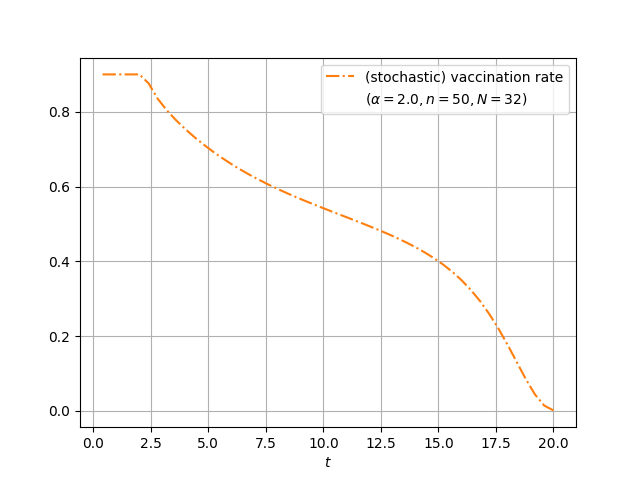

[](https://zenodo.org/doi/10.5281/zenodo.11669862)
[](LICENSE)
# EnsembleControl

The package is designed to solve optimal control problems that take the form

$$
\min_{u \in U} \frac{1}{N} \sum_{i=1}^N F(x^u(1,\xi^i), \xi^i) + (\alpha/2)\|u\|_{L^2(0,t_f;\mathbb{R}^m)}^2,
$$

where for each parameter $\xi \in \Xi$ and control $u(\cdot) \in L^2(0,t_f;\mathbb{R}^m)$, $x^u(\cdot, \xi) = x(\cdot, \xi)$ solves the uncertain dynamical system

$$
\dot{x}(t, \xi)  = f(x(t,\xi), u(t), \xi), \quad t \in (0,t_f), \quad x(0,\xi) = x_0(\xi).
$$

Here $\xi^i \in \Xi \subset \mathbb{R}^p$ are parameters, $t_f > 0$ is the final time, and
$f \colon \mathbb{R}^n  \times \mathbb{R}^m \times \Xi \to \mathbb{R}$ is the parameterized right-hand side.
This parameterized initial value problem allows for uncertain right-hand sides and initial values.
The set $U$ is a subset of $L^2(0,1;\mathbb{R}^m)$ such that 

$$
a_j \leq u_j(t) \leq b_j, \quad j = 1, \ldots, m, \quad t \in (0,t_f).
$$

Here $a_j$ and $b_j$ are numbers in $[-\infty, \infty]$ for $j=1, \dots, m$.

# Vaccination scheduling under model parameter uncertainty

We formulate a risk-neutral vaccination scheduling problem based on the control problem formulated in Miller Neilan, Rachael and Lenhart, Suzanne, Modeling paradigms and analysis of disease transmission models, [https://doi.org/10.1090/dimacs/075/03](https://doi.org/10.1090/dimacs/075/03).

We consider the optimal control problem 

$$
\min_{u \in L^2(0, 20;\mathbb{R})} \mathbb{E}\Big[\int_{0}^{20} I^u(t,\xi) dt\Big]+(\alpha/2)\|u\|_{L^2(0,20;\mathbb{R})}^2,
$$

where for each  control $u(\cdot) \in L^2(0, t_f;\mathbb{R})$
with $0 \leq u \leq 0.9$ and parameter 
$\xi = (a, b, c, d, e, g) \in \mathbb{R}_{>0}^6$,
the states 
$S^u(\cdot,\xi)$, $E^u(\cdot, \xi)$, $I^u(\cdot,\xi)$, $R^u(\cdot,\xi)$,
$N^u(\cdot, \xi)$ 
solve the SEIR model 

\begin{align}
S^{\prime}(t) & =b N(t)-d S(t)-c S(t) I(t)-u(t) S(t),& S(0)  &= S_0, \\
E^{\prime}(t) & =c S(t) I(t)-(e+d) E(t),  &E(0)  &= E_0, \\
I^{\prime}(t) & =e E(t)-(g+a+d) I(t), & I(0)  &= I_0, \\
R^{\prime}(t) & =g I(t)-d R(t)+u(t) S(t), & R(0)  &= R_0,  \\
N^{\prime}(t) & =(b-d) N(t)-a I(t), & N(0)  &= N_0.  
\end{align}

The control $u$ corresponds to a vaccination rate.

We choose with $\alpha = 2$, $a_1 = 0$, and $b_1 = 0.9$

We describe the parameter values and our
choice of the random vector $\xi \in \mathbb{R}^6$
used for our numerical simulation.
We use the initial states
$S_0 = 1000$, 
$E_0 = 100$,
$I_0 = 50$,
$R_0 = 15$.
We define $N_0 = S_0 + E_0 + I_0 + R_0$. 
We choose the nominal parameter 
$\bar \xi = (0.2, 0.525, 0.001, 0.5, 0.5, 0.1)$
for $\xi = (a, b, c, d, e, g)$
using the parameter values in \cite[Table 1]{MillerNeilan2010}.
We construct the random variables $\xi_i$, $i = 1, \ldots, 6$ through 
random relative
perturbations of the nominal parameter $\bar \xi$. Specifically,
for $\sigma = 0.1$ and independent random variables
$\rho_i$, $i = 1, \ldots, 6$, uniformly distributed on 
the interval $[-1,1]$, we define
\begin{align*}
	\xi_i = (1+\sigma \rho_i)\bar \xi_i,
	\quad i = 1, \ldots, 6.
\end{align*}

The following figure depicts the nominal (left) and reference solutions
(right).




# Documentation

None.

The control problem is discretized using a multiple shooting approach
following [Direct multiple shooting](https://github.com/casadi/casadi/blob/main/docs/examples/python/direct_multiple_shooting.py).
An explicit 4th order Runge--Kutta method is used to discretize the dynamical system.

# Installation

```
pip install git+https://github.com/milzj/EnsembleControl
```

# Demo

See [here](/demo).


# Docker

Create a local docker container via

```
docker build -t ensemblecontrol .
```

or

```
docker build -t ensemblecontrol . --no-cache --network=host
```

Run the docker container using

```
docker run -it ensemblecontrol sh
```

# Contributing

Information about how to contribute can be found
[here](CONTRIBUTING.md).

# Licence

See [here](LICENSE).
