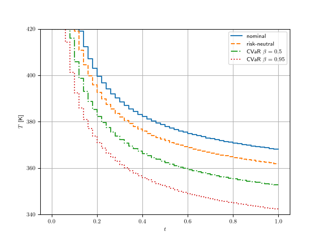
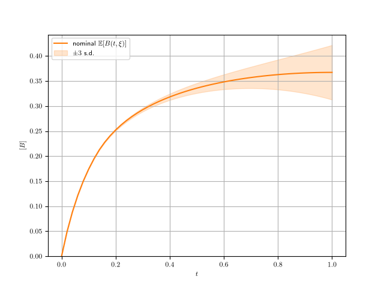
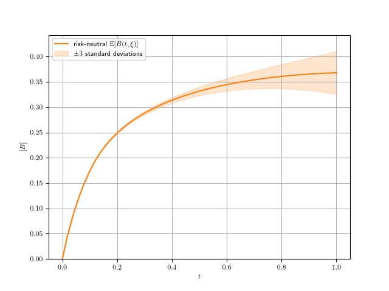
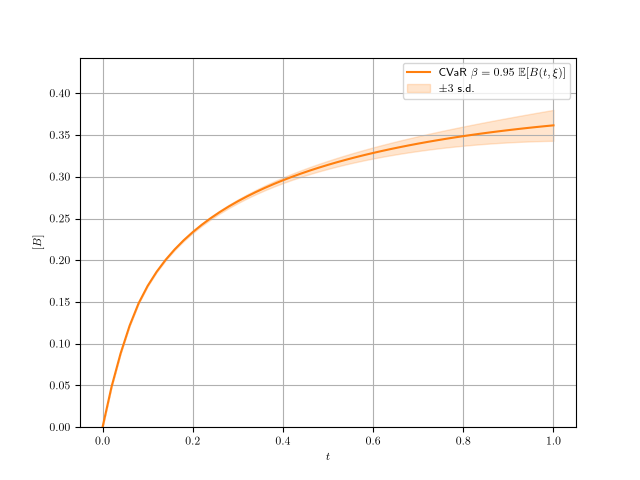
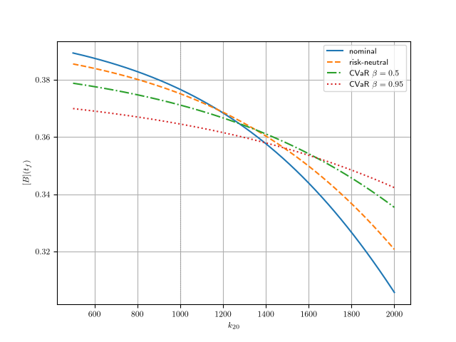
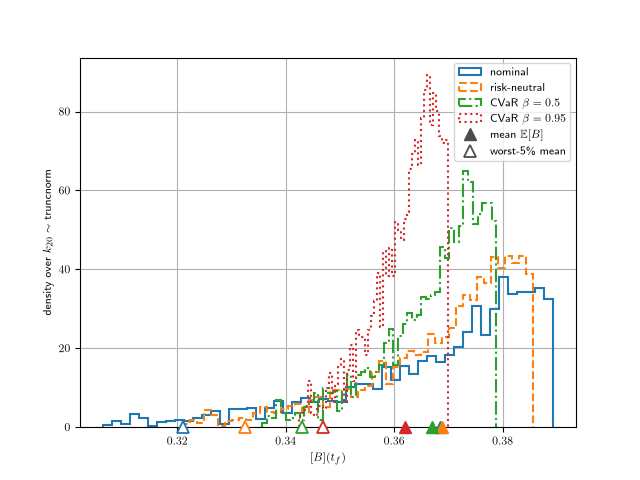
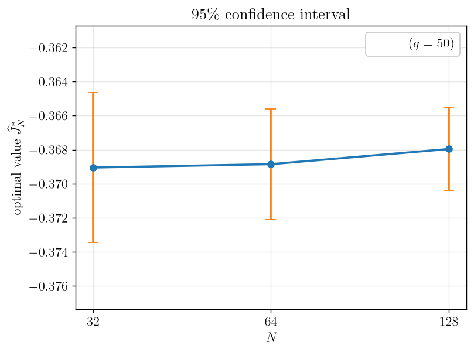
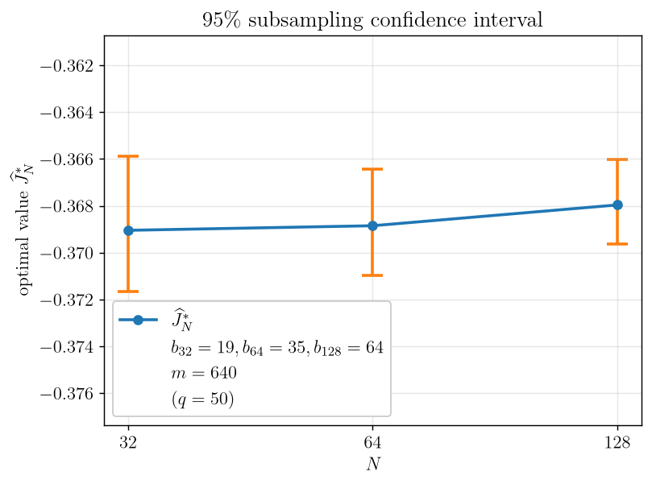
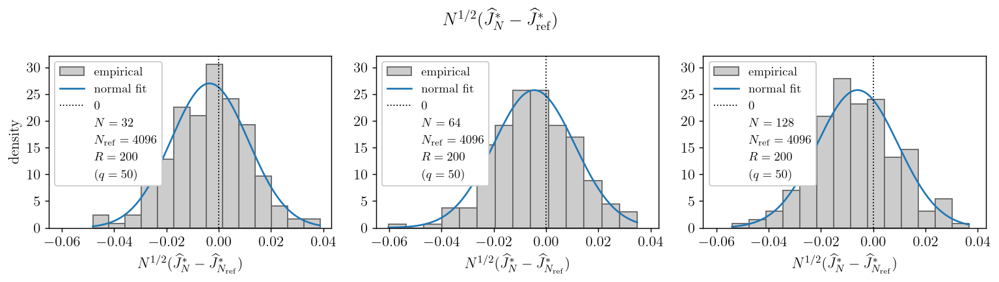

# Batch reactor: Temperature control under parametric uncertainty

A temperature-controlled batch reactor running the second-order reaction
$2A \to B \to C$ — $B$ is the desired product, $C$ an autocatalytic waste. The
temperature profile $T(t)$ is optimized while the **decomposition collision factor
$k_{20}$ is uncertain**, so the control must perform well across the whole
distribution of $k_{20}$ rather than at a single guessed value. This demo is based on the first numerical example of

> P. Terwiesch and M. Agarwal, "Robust input policies for batch reactors under
> parametric uncertainty," *Chemical Engineering Communications* **131** (1995),
> 33–52, https://doi.org/10.1080/00986449508936282

The paper's three strategies map directly onto the sample-average approximation
(SAA) risk settings:

| Paper | Here | Meaning |
| --- | --- | --- |
| nominal | **nominal** | solve at the mean $k_{20} = 1000$ |
| robust ($\min_u \mathbb{E}[J]$) | **risk-neutral SAA** | optimize the *expected* yield over $k_{20}$ |
| minimax (worst case) | **CVaR risk-averse** | optimize the worst $(1-\beta)$ tail; $\beta \to 1 \approx$ minimax |

## The model — [batch_reactor.py](batch_reactor.py)

With $x_1 = [A]$ and $x_2 = [B]$:

- **State** $x = (x_1, x_2) \in \mathbb{R}^2$, **control** $T(t)$ (temperature),
  **horizon** $t_f = 1$.
- **Dynamics** (dimensionless, Eqs. 22–23; $[C]$ eliminated by the mass balance
  $[A] + 2[B] + 2[C] = \text{const}$):

$$
\dot{x}_1 = -2 k_1 x_1^2, \qquad
\dot{x}_2 = k_1 x_1^2 - \frac{1}{2} k_2 x_2 (1 - x_1 - 2 x_2),
$$

with Arrhenius rates $k_1 = k_{10} e^{-E_1/(R T)}$ and
$k_2 = k_{20} e^{-E_2/(R T)}$.

- **Initial state**: $x_1(0) = 1 - 2[C]_0 = 0.99$, $x_2(0) = 0$.
- **Objective** (maximized): the final product $x_2(t_f)$ — coded as
  $F(x) = -x_2(t_f)$ (minimized).
- **Control box**: $T \in [340, 420]$ K.
- **Constants**: $R = 1.987$, $E_1 = 3\cdot10^3$, $E_2 = 4\cdot10^3$,
  $k_{10} = 100$, $[C]_0 = 5\cdot10^{-3}$.
- **Uncertainty**: $k_{20} \sim \mathrm{TruncatedNormal}(1000, 500)$ on
  $[500, 2000]$, drawn i.i.d. by Monte Carlo
  (`ensemblecontrol.TruncatedNormalSampler`). The nominal problem fixes $k_{20}$ at
  its mean $\mathbb{E}[k_{20}] \approx 1000$.
- **Discretization**: $q = 50$ control intervals (stair function,
  $\Delta t = 0.02$), single shooting, RK4 (`steps_per_interval = 10`).

## Requirements & how to run

All commands below are run **from this demo folder** (`demo/batch_reactor/`).
Create the project virtualenv once, **activate** it, and install `ensemblecontrol`
(editable); then the drivers run with a plain `python`:

```bash
python3 -m venv ../../.venv
source ../../.venv/bin/activate
pip install -e ../..
python saa_batch_reactor.py   # policies + control/state + yield + confidence intervals
python clt_batch_reactor.py   # central-limit-theorem study
```

The drivers only ever `savefig` (they never call `plt.show()`), so any matplotlib
backend works — `MPLBACKEND=Agg` is **not** required. On a headless machine, prefix
the command with it to force the non-interactive backend, e.g.
`MPLBACKEND=Agg python saa_batch_reactor.py`.

`saa_batch_reactor.py` solves the nominal, risk-neutral, and CVaR ($\beta = 0.95$)
policies with **IPOPT**; writes the control overlay and per-policy control/state
plots to [output/controls-state/](output/controls-state/); writes the
yield-vs-$k_{20}$ and out-of-sample yield-distribution figures; and runs the
plug-in and subsampling confidence intervals. Flags:
`--algorithm {plugin,subsampling,both}` (default both), `--m` / `--b`
(subsampling count / block size), `--workers`.

## Problem formulation

Let $x_2(t_f, \xi)$ be the final product $[B]$ at scenario $\xi = k_{20}$ under a
temperature policy $T$. All policies share the dynamics and $T \in [340, 420]$;
they differ only in how the uncertain terminal yield is scored.

**Nominal** — maximize the yield at the mean parameter only:

$$
\max_T x_2(t_f, 1000).
$$

**Risk-neutral** (the paper's *robust* policy) — maximize the *expected* yield; the
SAA replaces the expectation by the sample mean over $N$ i.i.d. scenarios:

$$
\max_T \mathbb{E}[x_2(t_f, \xi)]
\approx
\max_T \frac{1}{N}\sum_{i=1}^{N} x_2(t_f, \xi_i).
$$

**CVaR risk-averse** — maximize the mean yield over the worst $(1 - \beta)$
fraction of scenarios (the low-yield tail, which occurs at large $k_{20}$, i.e.
fast decomposition). Writing the per-scenario loss $F_i = -x_2(t_f, \xi_i)$, the
empirical CVaR of the loss $F$ has the Rockafellar–Uryasev variational form

$$
\mathrm{CVaR}_\beta(F) = \min_{t \in \mathbb{R}} \left\{ t + \frac{1}{(1-\beta)N}\sum_{i=1}^{N}(F_i - t)_+ \right\},
\qquad (y)_+ = \max\{y, 0\},
$$

where $t$ is the Value-at-Risk level. Introducing one slack $s_i$ per scenario to
lift each $(F_i - t)_+$ turns the SAA into a smooth joint minimization over the
control $u$, the threshold $t$, and the slacks $s$ — a deterministic
multi-scenario optimal control problem (implemented in
[`risk_measures.py`](../../src/ensemblecontrol/risk_measures.py)):

$$
\begin{aligned}
\min_{u, t, s} \quad & t + \frac{1}{(1-\beta)N}\sum_{i=1}^{N} s_i \\
\text{s.t.} \quad & s_i \ge F_i - t, \quad s_i \ge 0, \quad i = 1, \ldots, N.
\end{aligned}
$$

The scenarios couple only through the shared control $u$ and threshold $t$. Here
$\beta = 0.95$; $\beta \to 1$ approaches the paper's **minimax** (worst-case)
policy.

## Control profiles

The optimal temperature profiles $T(t)$ for the three policies, overlaid on the
$[340, 420]$ box (each policy drawn with a distinct line style): hot early to drive
the main reaction, then cooling toward the end to suppress the $B \to C$
decomposition — the CVaR profile runs coolest through the tail-sensitive second
half.



Per-policy temperature profiles are in
[output/controls-state/](output/controls-state/) as
`{nominal,risk-neutral,cvar-0.95}_control.png`.

The corresponding **product state** $[B](t)$ — its ensemble mean
$\mathbb{E}[B(t, \xi)]$ with a $\pm 3$ s.d. band, obtained by simulating each fixed
control across the *same* $k_{20}$ ensemble (so even the nominal policy, whose own
solve carries a single scenario, shows a meaningful spread) on a shared $y$-axis —
makes the robustness ordering visible: the nominal control, tuned to $k_{20} = 1000$,
spreads most through the tail-sensitive second half; risk-neutral is tighter; CVaR
is tightest.

| nominal | risk-neutral | CVaR $\beta = 0.95$ |
| --- | --- | --- |
|  |  |  |

## The mean–tail trade-off out of sample

The control is fixed before $k_{20}$ is known, so a good policy must hedge the
whole distribution. **Per scenario**, the terminal yield as a function of $k_{20}$
(the paper's Figure 2) shows the trade-off: the nominal policy peaks near
$k_{20} = 1000$ but plunges in the tail; risk-neutral is flatter; CVaR is flattest.



**Aggregated** over a large independent out-of-sample draw
$k_{20} \sim \mathrm{TruncatedNormal}(1000, 500)$, the histogram of the terminal
yield $[B]$ under each policy (solid vertical line = the mean $\mathbb{E}[B]$;
dashed vertical line = the *worst-5% mean*) makes the ordering precise:



The **worst-5% mean** is the average yield over the 5% of scenarios with the
*lowest* yield — the mean $[B]$ you obtain on the unluckiest 5% of batches (the
high-$k_{20}$, fast-decomposition draws). It is the empirical CVaR of the yield and
is exactly the tail quantity the CVaR policy maximizes; a larger value means a
better worst case.

| policy | mean $\mathbb{E}[B]$ | worst-5% mean | min $[B]$ |
| --- | ---: | ---: | ---: |
| nominal | 0.3684 | 0.3210 | 0.3062 |
| risk-neutral (robust) | **0.3689** | 0.3324 | 0.3211 |
| CVaR, $\beta = 0.95$ | 0.3620 | **0.3468** | **0.3425** |

- **Risk-neutral beats nominal** on the *mean* yield ($0.3689 > 0.3684$): tuning to
  $k_{20} = 1000$ alone leaves expected yield on the table across the distribution.
- **CVaR beats risk-neutral** on the *tail* (worst-5% mean $0.3468 > 0.3324$; worst
  case $0.3425 > 0.3211$): it accepts a lower mean ($0.3620$) to lift the worst
  outcomes — the risk-averse choice when a bad batch is costly.

(The nominal yield at $k_{20} = 1000$ is $\approx 0.377$, matching the paper's
Table 1 value $0.3773$.)

## Statistical inference

Only the **risk-neutral** SAA optimal value $\hat J_N^* = \mathbb{E}_N[-B]$ is
analyzed (the nominal and CVaR policies are not swept), so the output folders and
files are named `risk-neutral-*`. The value from a finite scenario sample is itself
random; because `TruncatedNormalSampler` draws i.i.d. Monte-Carlo scenarios, the
SAA is solved on nested prefixes $N \in \{32, 64, 128\}$ and reused as the anchor
for every algorithm.

**Plug-in CI** (Algorithm 1 — normal interval from the in-sample loss variance) and
**subsampling CI** (Algorithm 2 — valid for nonunique optimizers, each subsample
IPOPT-re-solved), $\hat J_N^*$ vs $N$ with the interval at 95%:

| plug-in CI | subsampling CI |
| --- | --- |
|  |  |

Raw data and every figure (all timestamp-free) are under
[output/risk-neutral-inference/](output/risk-neutral-inference/)
(`risk-neutral_plugin_*`, `risk-neutral_plugin-oos_*`, `risk-neutral_subsampling_*`).

**Central-limit-theorem study** ([clt_batch_reactor.py](clt_batch_reactor.py)) — the
histograms of $\sqrt{N}(\hat J_N^* - \hat J_{\mathrm{ref}}^*)$ across
$N \in \{32, 64, 128\}$ (each replicate IPOPT-solved and warm-started from an
independent size-$N_{\mathrm{ref}}$ reference), which approach a centered Gaussian
as $N$ grows; output under
[output/risk-neutral-limit-theorem/](output/risk-neutral-limit-theorem/):



(The SAA optimal value here is $J = \mathbb{E}[-B] < 0$, since the package minimizes
and the objective maximizes $B$; the confidence intervals bound that value.)
