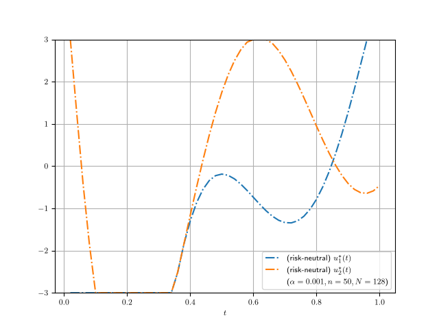
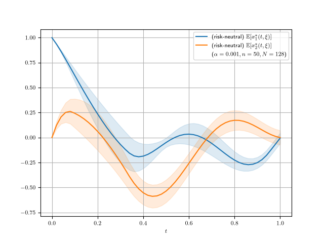

# Harmonic oscillator: risk-neutral optimal control and statistical inference under uncertainty

A two-state harmonic oscillator whose **angular frequency `k` is uncertain** is
steered to the origin by a two-component control. The frequency is unknown at the
time the control is chosen, so the control is optimized *across the whole
distribution of `k`* with the **sample average approximation (SAA)** — minimizing
the **expected** terminal cost (the risk-neutral problem). The SAA optimal value
computed from a finite scenario sample is itself random, so the demo's main focus
is **quantifying its sampling error**: two confidence-interval algorithms and a
central-limit-theorem study.

The problem is Problem `S_C` of [doi:10.1137/140983161](https://doi.org/10.1137/140983161);
the uncertainty-aware treatment and the statistical results follow Melnikov & Milz
([arXiv:2407.18182](https://arxiv.org/abs/2407.18182)) and the manuscript
*Statistical Inference for Optimal Values in Scenario-Based Optimal Control under
Uncertainty*.

## The model — [harmonic_oscillator.py](harmonic_oscillator.py)

- **State** `x ∈ ℝ²`, **control** `u ∈ ℝ²`, **horizon** `t_f = 1`.
- **Dynamics**: `ẋ₁ = −k·x₂ + u₁`, `ẋ₂ = k·x₁ + u₂`, with initial state
  `x(0) = (1, 0)`. The uncertain angular frequency is `k`.
- **Terminal cost** (minimized): `F(x(t_f)) = ½‖x(t_f)‖²` — how far the final
  state is from the origin.
- **Running cost**: `(α/2)‖u‖²` with `α = 1e-3` (a small control penalty).
- **Control box**: `u ∈ [−3, 3]²`.
- **Uncertainty**: `k ~ U[0, 2π]`, drawn i.i.d. by Monte Carlo
  (`ensemblecontrol.UniformSampler(..., method="mc")`). The **nominal** problem
  fixes `k` at its mean `𝔼[k] = π`.
- **Discretization**: `50` control intervals, **single shooting** (the states are
  integrated out; the decision vector is the piecewise-constant control), RK4.

## Requirements & how to run

Create the project virtualenv once, from the repository root, and install the
`ensemblecontrol` package into it (editable):

```bash
cd <repo-root>/EnsembleControl
python3 -m venv .venv
./.venv/bin/pip install -e .        # installs ensemblecontrol and its dependencies (numpy, casadi, matplotlib, ...)
```

Then run the drivers **from this demo folder** (`demo/harmonic_oscillator/`) so the
relative `../../.venv/bin/python` path resolves and the local `from
harmonic_oscillator import ...` import works. `MPLBACKEND=Agg` renders figures
headless:

```bash
MPLBACKEND=Agg ../../.venv/bin/python saa_harmonic_oscillator.py   # nominal + risk-neutral + confidence intervals
MPLBACKEND=Agg ../../.venv/bin/python clt_harmonic_oscillator.py   # central-limit-theorem study
```

Useful flags: `saa_harmonic_oscillator.py --algorithm {plugin,subsampling,both}`
(default `both`), `--m` / `--b` (subsampling count / block size), `--workers`;
`clt_harmonic_oscillator.py --R` (replicates) / `--n-ref` (reference size).
**Every solve uses IPOPT** (`SAAProblem.solve`). Figures use LaTeX when a `latex`
binary is on `PATH`, otherwise matplotlib's mathtext. All outputs land under
[output/](output/) at fixed, timestamp-free paths.

## Problem formulation

Let `x^u(t_f, ξ)` be the terminal state under control `u` and scenario `ξ = k`,
and `F(x^u(t_f, ξ)) = ½‖x^u(t_f, ξ)‖²` the terminal loss. Both problems add the
running cost `(α/2)∫‖u‖²` and keep `u ∈ [−3, 3]²`.

**Nominal** — solve at the mean parameter only, `k = 𝔼[k] = π` (a single scenario).

**Risk-neutral** — minimize the *expected* terminal loss; with `N` i.i.d.
scenarios `ξ₁,…,ξ_N` the SAA replaces the expectation by the sample mean:

```
min_u  𝔼[F(x^u(t_f, ξ))]      ≈      min_u  (1/N) Σ_i F(x^u(t_f, ξ_i))
```

Representative optimal values from a default run: nominal `J = 4.997e-04`,
risk-neutral `J = 8.518e-03` (the nominal control, tuned to `k = π` alone, is far
more expensive once averaged over the whole `k` distribution).

## Statistical inference

The risk-neutral SAA optimal value `Ĵ_N*` from a finite sample is random. The
package provides two confidence-interval algorithms and a limit-theorem study for
it (the risk-neutral SAA is solved on nested prefixes `N ∈ {32, 64, 128}` and
reused as the anchor for every algorithm):

- **[saa_harmonic_oscillator.py](saa_harmonic_oscillator.py)** — the **plug-in CI**
  (Algorithm 1: normal interval from the in-sample loss variance, plus
  out-of-sample-variance variants) and the **subsampling CI** (Algorithm 2: valid
  for nonunique optimizers, each subsample re-solved with IPOPT). Raw data go to
  JSON and figures are rendered from it, all timestamp-free, under
  [output/inference/](output/inference/) (`plugin_*`, `plugin-oos_*`,
  `plugin-oos-matched_*`, `subsampling_*`).
- **[clt_harmonic_oscillator.py](clt_harmonic_oscillator.py)** — a Monte-Carlo
  central-limit study: `√N(Ĵ_N* − Ĵ_ref*)` histograms across `N ∈ {32, 64, 128}`,
  each replicate IPOPT-solved and warm-started from an independent size-`N_ref`
  reference solution; output under [output/limit_theorem/](output/limit_theorem/)
  (`clt_*`).

## Plots

Control and state trajectories for the nominal and risk-neutral solves are written
to [output/controls-state/](output/controls-state/) as
`{nominal,risk-neutral}_{controls,states}.png`. The control plots are framed on the
`[−3, 3]` box; the state plots show the ensemble mean `𝔼[xⱼ]` with a ±1 s.d. band.

Optimal controls `u₁*(t)`, `u₂*(t)` and the ensemble states `𝔼[xⱼ*(t, ξ)]`:

| risk-neutral controls | risk-neutral states |
| --- | --- |
|  |  |

## Scripts

| Script | Solver | What it does |
| --- | --- | --- |
| [harmonic_oscillator.py](harmonic_oscillator.py) | — | The model (`HarmonicOscillator(ControlProblem)`); imported, not run directly. |
| [saa_harmonic_oscillator.py](saa_harmonic_oscillator.py) | IPOPT | Nominal + risk-neutral solves and control/state plots, then the plug-in (Algorithm 1) and subsampling (Algorithm 2) confidence intervals for the risk-neutral SAA optimal value. |
| [clt_harmonic_oscillator.py](clt_harmonic_oscillator.py) | IPOPT | Monte-Carlo central-limit-theorem study: `√N(Ĵ_N* − J*)` histograms across `N ∈ {32, 64, 128}`, each replicate IPOPT-solved and warm-started from an independent size-`N_ref` reference solution. |

## Notes

- **IPOPT throughout** — the nominal/risk-neutral solves, the subsampling re-solves,
  and the CLT replicates all use IPOPT (`SAAProblem.solve`). Warm-started solves
  project the starting control into the strictly-interior box
  `[lb + 0.01·(ub−lb), ub − 0.01·(ub−lb)] = [−2.94, 2.94]`, since an interior-point
  method must not start exactly on a bound.
- **Confidence intervals require i.i.d. scenarios**, so `k` is drawn by Monte Carlo
  (`method="mc"`); the full-sample (`N = 128`) SAA is solved once and reused as the
  largest plug-in sample size and the subsampling anchor.
- **Fixed, timestamp-free outputs.** Re-running overwrites the same files under
  [output/](output/).
- CVaR risk-averse control is available in the framework (`SAAProblem(..., beta=β)`)
  and demonstrated in the [batch-reactor demo](../batch_reactor/); for this
  oscillator the risk-averse control differs little from the risk-neutral one, so it
  is not included here.
